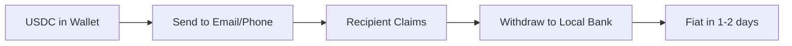

# 🌴 StablePago - Caribbean's Crypto-to-Fiat Bridge

<div align="center">
  
  
  **Connecting stablecoins to Caribbean banks, starting with Puerto Rico 🇵🇷, Dominican Republic 🇩🇴, and Haiti 🇭🇹**
  
  [](https://crossmint.com)
  [](https://circle.com)
  [](https://circle.com)
</div>

## Table of Contents

- [Introduction](#introduction)
- [Caribbean Strategy](#caribbean-strategy)
- [Features](#features)
  - [Core Features](#core-features)
  - [Wallet Creation for Email](#wallet-creation-for-email-addresses)
  - [Telegram Shopping](#telegram-shopping-delegation)
  - [Bank Withdrawals](#withdraw-to-bank-circle)
- [Setup](#setup)
- [Environment Variables](#environment-variables)
- [Database Setup](#database-setup)
- [Production Deployment](#using-in-production)
- [Roadmap](#roadmap)
- [Support](#support)

## Introduction

**StablePago** is the first stablecoin-to-fiat bridge designed specifically for the Caribbean market, enabling instant, low-cost withdrawals from USDC to local bank accounts and mobile money.

### 🎯 Mission
Bridge the $25B+ Caribbean remittance market with blockchain efficiency, reducing costs by 80% and settlement time from days to minutes.

### 💫 Vision
Become the financial infrastructure layer for the 44M people in the Caribbean, starting with three strategic markets:

```
🇵🇷 Puerto Rico → Direct USD (No FX needed)
🇩🇴 Dominican Republic → USD to DOP conversion  
🇭🇹 Haiti → Mobile money first (MonCash/Natcom)
```

### 🚀 Current MVP Flow


## Caribbean Strategy

### 📊 Market Opportunity

| Market | Population | Remittance Volume | Our Advantage |
|--------|------------|------------------|---------------|
| **Puerto Rico** 🇵🇷 | 3.2M | $500M/year | Direct USD, US banking rails |
| **Dominican Republic** 🇩🇴 | 11.2M | $10.4B/year | 60% cheaper than Western Union |
| **Haiti** 🇭🇹 | 11.7M | $4.4B/year | Mobile money, skip banks |

### 💰 Why Caribbean First?

1. **Massive Diaspora**: 5M+ Caribbean people in US sending money home
2. **High Fees**: Current services charge 5-10% 
3. **Slow Settlement**: 3-5 days for traditional transfers
4. **Mobile Ready**: 90%+ smartphone penetration
5. **Dollar Familiar**: USD already widely used

### 🌟 Our Competitive Edge

| Feature | Traditional Services | StablePago |
|---------|---------------------|------------|
| **Fees** | 5-10% | **1.25%** |
| **Speed** | 3-5 days | **1-2 days** |
| **Minimum** | $50-100 | **$1** |
| **Hours** | Business hours | **24/7/365** |
| **Transparency** | Hidden fees | **On-chain visible** |

## Features

### Core Features

- 🔐 **Email/Social Login** - No crypto knowledge needed
- 💳 **Buy USDC with Card** - Instant funding via Crossmint
- 📧 **Send by Email** - Recipient doesn't need a wallet
- 🏦 **Withdraw to Banks** - Direct to Caribbean banks
- 📱 **Mobile Money** - MonCash (Haiti), Orange (DR)
- 🌐 **Multi-Chain** - Works on 40+ blockchains
- 🤖 **Telegram Shopping** - Delegate spending to bots
- 💱 **Multi-Currency** (Coming with Arc) - USDC → Local currency

### Wallet Creation for Email Addresses

Perfect for onboarding non-crypto users like "Grandma":

```typescript
// Create wallet for any email
await createWallet("grandma@gmail.com")
// Grandma can now receive USDC and withdraw to her bank!
```

**Features:**
- Instant wallet creation
- No app download required
- Access via email login
- Automatic key management

 Real-World Assets (RWA)
Position StablePago as "AI-Powered Caribbean Remittance Infrastructure" - the first autonomous agent system that converts remittances into real economic activity.

🤖 The AI Agent Architecture 
1. Remittance Intelligence Agent

```typescript
class RemittanceAI {
  // Natural language processing for payments
  async processCommand(input: string) {
    // "Send $100 to mom in Santo Domingo for groceries"
    const intent = await AI.parse(input);
    
    return {
      recipient: "Mom",
      amount: 100,
      purpose: "groceries",
      location: "Santo Domingo",
      suggestedMerchants: ["Supermercado Nacional", "Jumbo"]
    };
  }
}
```

2. FX Optimization Agent

```typescript
class FXOptimizerAgent {
  // Monitors rates 24/7 and executes at optimal times
  async optimizeTiming(transfer: Transfer) {
    const rate = await AI.drRates({
      pair: "USDC/DOP",
      horizon: "24h"
    });
    
    if (rate.bestTime === "now") {
      return executeImmediately();
    } else {
      return scheduleForOptimalRate(prediction.bestTime);
    }
  }
}
```

3. Local Economy Agent (The Game Changer!)
```typescript
class LocalEconomyAgent {
  // Converts remittances into productive capital
  async allocateRemittance(payment: Payment) {
    // Split remittance intelligently
    const allocation = {
      immediate: 70,  // % for family needs
      investment: 20,  // % into local business loans
      savings: 10      // % into yield-bearing USYC
    };
    
    // Autonomous execution on Arc
    await arc.execute([
      sendToFamily(payment.amount * 0.7),
      investInLocalBusiness(payment.amount * 0.2),
      depositToYield(payment.amount * 0.1)
    ]);
    
    return {
      impact: "Created $20 of local economic activity",
      roi: "Family business funded at 12% APY"
    };
  }
}
```

 ## Arc-Specific Features 
```typescript
const ArcIntegration = {
  // 1. USDC as gas (no ETH complexity!)
  gasSimplicity: "Granny never sees ETH, just USDC",
  
  // 2. Sub-second finality
  speed: "Instant settlement for urgent medical payments",
  
  // 3. Native FX engine
  fx: "Real-time USDC→EURC→Local currency",
  
  // 4. Confidential transfers
  privacy: "Hide remittance amounts from public"
}
```

### Telegram Shopping Delegation

Let users shop via Telegram with spending controls:

```typescript
{
  bot: "@StablePagoBot",
  limits: {
    perItem: "$30",
    daily: "$50",
    weekly: "$200"
  },
  categories: ["grocery", "pharmacy"]
}
```

**Use Cases:**
- Remote shopping for family
- Automated bill payments
- Controlled spending for dependents

  **Telegram Bot Integration:**
See the [crossmint-checkout-telegram-agent](https://github.com/Crossmint/examples/tree/main/apps/wallets/delegation/crossmint-checkout-telegram-agent) example for bot implementation.

---


### Withdraw to Bank (Circle)

#### 🇵🇷 Puerto Rico
- **Direct USD** - No conversion needed
- **US Banks** - ACH/Wire support
- **1-2 days** - Standard US banking speed
- **Supported Banks**: Banco Popular, FirstBank, Oriental, Santander

#### 🇩🇴 Dominican Republic
```typescript
// Automatic DOP conversion
withdraw({
  amount: 100,  // USDC
  bank: "Banco Popular Dominicano",
  receives: "6,000 DOP"  // At current rate
})
```

#### 🇭🇹 Haiti
```typescript
// Direct to mobile money
withdraw({
  amount: 50,  // USDC
  destination: "MonCash: 3765-1234",
  receives: "7,500 HTG"  // Instant to phone
})
```


### Withdraw to Bank (Circle)

Withdraw USDC to a bank account using Circle's payout infrastructure. Currently supports wire transfers to US banks (Puerto Rico included).

**How to use:**
1. Click the menu (⋮) on the dashboard
2. Select "Withdraw to Bank"
3. First time: Add bank details (routing number, account number)
4. Enter amount and confirm
5. Track payout status in real-time

**Circle Flow:**
1. Create bank beneficiary (first time only)
2. Create payout request
3. Circle processes the transfer
4. Funds arrive in bank account (1-2 business days)

**Database:**
- bank_beneficiaries - Stores linked bank accounts
- fiat_payouts - Tracks payout status (pending → processing → succeeded/failed)

**API Endpoints:**
- POST /api/circle/create-beneficiary - Link bank account
- POST /api/circle/create-payout - Initiate withdrawal
- GET /api/circle/payout-status/:id - Check status

**Circle Requirements:**
- API key from Circle Console
- Travel Rule compliance for payouts ≥ $3,000 (identity verification)
- Sufficient balance in Circle account

---

## Using in production

To deploy StablePago to production:

### 1. Crossmint Production Setup

Login to the [Crossmint production console](https://www.crossmint.com/console)
Create production API keys with these scopes:
users.create, users.read
wallets.read, wallets.create
wallets:transactions.create, wallets:transactions.sign, wallets:transactions.read
wallets:balance.read
wallets.fund
wallets:signers.create, wallets:signers.read (for delegation)

Update .env.local:
env
NEXT_PUBLIC_CROSSMINT_CLIENT_API_KEY=pk_live_...
CROSSMINT_SERVER_SIDE_API_KEY=sk_live_...
CROSSMINT_ENV=production

Customize email templates in Console → Settings → Branding

**⚠️ Note**: Non-custodial signers for Solana are undergoing security audit. Join [Telegram](https://t.me/crossmintdevs) for updates.

## Setup

### Quick Start

```bash
# 1. Clone repository
git clone https://github.com/JdejesusIsaac/stablePago.git
cd stablePago/fintech-starter-app

# 2. Install dependencies
pnpm install

# 3. Set up environment (see below)
cp .env.example .env.local

# 4. Run development server
pnpm dev
```

### Required Services

1. **[Crossmint](https://staging.crossmint.com/console)** - Wallet infrastructure
2. **[Supabase](https://supabase.com)** - Database
3. **[Circle](https://console.circle.com)** - Bank payouts (optional in dev)

## Environment Variables

### Essential Configuration

```env
# Crossmint (Required)
NEXT_PUBLIC_CROSSMINT_CLIENT_API_KEY=pk_staging_...
CROSSMINT_SERVER_SIDE_API_KEY=sk_staging_...
CROSSMINT_ENV=staging

# Chain Configuration
NEXT_PUBLIC_CHAIN_ID=base-sepolia
NEXT_PUBLIC_USDC_MINT=0x036CbD53842c5426634e7929541eC2318f3dCF7e

# Supabase (Required)
NEXT_PUBLIC_SUPABASE_URL=https://xxx.supabase.co
NEXT_PUBLIC_SUPABASE_ANON_KEY=eyJ...
SUPABASE_SERVICE_ROLE_KEY=eyJ...

# Circle (For withdrawals)
CIRCLE_BASE_URL=https://api-sandbox.circle.com
CIRCLE_API_KEY=SAND_API_KEY_...
PAYMENTS_CIRCLE_ENABLED=true

# Telegram Bot (Optional)
NEXT_PUBLIC_TELEGRAM_BOT_ADDRESS=0x...
```

## Database Setup

Run migrations in order:

```sql
-- 1. Core tables
supabase/migrations/20250107_init_stablepago.sql

-- 2. Delegation support
supabase/migrations/20250108_telegram_shopping.sql

-- 3. Wallet tracking
supabase/migrations/20250108_wallet_creation_tracking.sql
```

## Using in Production

### Deployment Checklist

#### Phase 1: Puerto Rico Launch
- [ ] Circle production API for USD payouts
- [ ] Partner with 4 major PR banks
- [ ] Spanish language support
- [ ] Marketing to NYC Puerto Ricans

#### Phase 2: Dominican Republic
- [ ] DOP conversion partner (Remesas Vimenca)
- [ ] Integrate with Banco Popular Dominicano
- [ ] Dominican consulate partnerships
- [ ] WhatsApp support channel

#### Phase 3: Haiti
- [ ] MonCash API integration
- [ ] Kreyòl language support
- [ ] Partner with Red Cross
- [ ] Church community outreach

### Compliance Requirements

```typescript
// Required for operations
const compliance = {
  puerto_rico: {
    license: "Money Transmitter License",
    kyc: "US Standard KYC",
    reporting: "FinCEN"
  },
  dominican_republic: {
    partner: "Licensed remittance company",
    kyc: "Enhanced due diligence",
    limits: "$10,000/month"
  },
  haiti: {
    partner: "MonCash (Digicel)",
    kyc: "Basic identity verification",
    limits: "$2,500/month"
  }
}
```

## Roadmap

### ✅ Q1 2025 - Foundation
- [x] Crossmint wallet integration
- [x] Circle payout setup
- [x] Email-based transfers
- [x] Telegram bot delegation
- [ ] Puerto Rico bank partnerships

### 🔄 Q2 2025 - Caribbean Expansion
- [ ] Dominican Republic launch
- [ ] DOP conversion integration
- [ ] Mobile money for Haiti
- [ ] Multi-language support (Spanish, Kreyòl)

### 🚀 Q3 2025 - Arc Integration
- [ ] Migrate to Arc L1 blockchain
- [ ] USDC as gas (no ETH needed!)
- [ ] Native FX engine integration
- [ ] Sub-second settlement

### 🌍 Q4 2025 - Scale
- [ ] Support for EURC (European diaspora)
- [ ] Expand to Jamaica, Trinidad
- [ ] B2B payroll solutions
- [ ] $100M annualized volume

### 🎯 2026 Vision
- [ ] All 15 Caribbean nations
- [ ] Central/South America expansion
- [ ] Native stablecoins (DOPC, HTGC)
- [ ] Replace Western Union in Caribbean

## Technology Partners

### Current Stack
- **[Crossmint](https://crossmint.com)** - Smart wallet infrastructure
- **[Circle](https://circle.com)** - USDC and bank payouts
- **[Supabase](https://supabase.com)** - Database and auth

### Future Integration (2025)
- **[Arc by Circle](https://circle.com/arc)** - Purpose-built L1 for stablecoins
  - USDC as native gas (no ETH!)
  - <1 second finality
  - Native FX engine
  - Confidential transfers
  - When Arc Launches:
Create synthetic DOPC and HTGC stablecoins
Enable direct Caribbean FX pairs
Reduce fees from 3% to 0.5%
Instant settlement vs hours
  
 https://github.com/circlefin/stablecoin-evm/blob/master/contracts/v1/FiatTokenV1.sol

## Support

### Community
- 🌴 **Discord**: [Join StablePago Community](https://discord.gg/stablepago)
- 💬 **Telegram**: [@StablePago](https://t.me/stablepago)
- 🐦 **Twitter**: [@StablePago](https://twitter.com/stablepago)

### Technical Support
- **Crossmint**: [Docs](https://docs.crossmint.com/) | [Telegram](https://t.me/crossmintdevs)
- **Circle**: [Docs](https://developers.circle.com/) | [Support](https://support.circle.com/)
- **Issues**: [GitHub](https://github.com/JdejesusIsaac/stablePago/issues)

### Business Inquiries
- **Partnerships**: partnerships@stablepago.com
- **Caribbean Banks**: banks@stablepago.com
- **Investors**: investors@stablepago.com

---

<div align="center">

**Built with ❤️ for the Caribbean**

*Making remittances as easy as sending a text*

[Website](https://stablepago.com) • [Demo](https://demo.stablepago.com) • [Docs](https://docs.stablepago.com)

</div>

